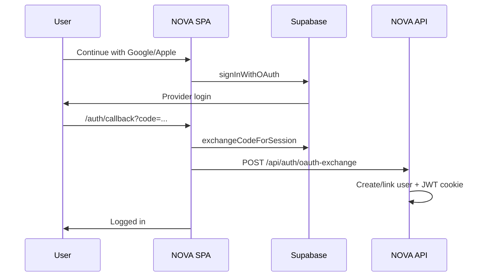

# Google & Apple sign-in (NOVA)

NOVA uses **Supabase Auth** for OAuth. Password login still works without Supabase.

## 1. Create a Supabase project

1. Go to [supabase.com](https://supabase.com) → **New project**
2. **Project Settings → API** — copy:
   - **Project URL** → `SUPABASE_URL` / `VITE_SUPABASE_URL`
   - **anon public** key → `SUPABASE_ANON_KEY` / `VITE_SUPABASE_ANON_KEY`
   - **service_role** key (server only, never in the browser) → `SUPABASE_SERVICE_ROLE_KEY`

## 2. Configure environment files

**Root `.env`** (server):

```env
SUPABASE_URL=https://YOUR_PROJECT.supabase.co
SUPABASE_ANON_KEY=eyJ...
SUPABASE_SERVICE_ROLE_KEY=eyJ...
```

**`client/.env`** (React build — copy the same URL and anon key):

```env
VITE_SUPABASE_URL=https://YOUR_PROJECT.supabase.co
VITE_SUPABASE_ANON_KEY=eyJ...
```

Rebuild after changing client env:

```bash
npm run build
npm start
```

## 3. Supabase redirect URLs

**Authentication → URL configuration**

| Setting | Value |
|--------|--------|
| Site URL | `http://localhost:3000` (dev) or `https://novadeluxe.dpdns.org` (prod) |
| Redirect URLs | Add **all** of these: |

```
http://localhost:3000/auth/callback
http://localhost:5173/auth/callback
https://novadeluxe.dpdns.org/auth/callback
https://YOUR_PROJECT.supabase.co/auth/v1/callback
```

## 4. Enable Google

1. Supabase → **Authentication → Providers → Google** → Enable
2. [Google Cloud Console](https://console.cloud.google.com/) → APIs & Services → Credentials
3. Create **OAuth 2.0 Client ID** (Web application)
4. Authorized redirect URI (Google side):

   `https://YOUR_PROJECT.supabase.co/auth/v1/callback`

5. Paste **Client ID** and **Client Secret** into Supabase Google provider settings

## 5. Enable Apple

1. [Apple Developer](https://developer.apple.com/) → Identifiers → **Services ID**
2. Enable **Sign in with Apple**, configure domains and return URL:

   `https://YOUR_PROJECT.supabase.co/auth/v1/callback`

3. Create a **Key** for Sign in with Apple (`.p8` file)
4. Supabase → **Authentication → Providers → Apple** → Enable  
   Fill in Services ID, Team ID, Key ID, and private key

Apple requires HTTPS in production; localhost works for Google during dev.

## 6. Test

1. `npm run build && npm start`
2. Open http://localhost:3000/login
3. Click **Continue with Google** or **Continue with Apple**
4. After redirect, you should land on **Account** with a NOVA session cookie

Check server log on startup: `Supabase: ENABLED ✓`

## Troubleshooting

| Issue | Fix |
|-------|-----|
| Buttons show setup hint | Fill `client/.env` and rebuild |
| `OAuth is not configured` on server | Fill root `.env` `SUPABASE_*` and restart |
| Redirect mismatch | Add exact callback URL in Supabase + Google/Apple consoles |
| Apple works only on HTTPS | Use production URL or test Google locally first |
| Email already exists | User signed up with password; use same provider or link in Supabase |

## How it works


